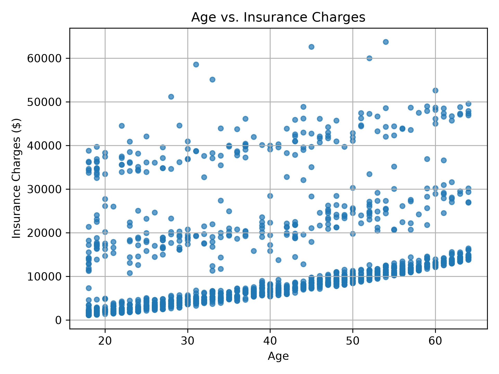
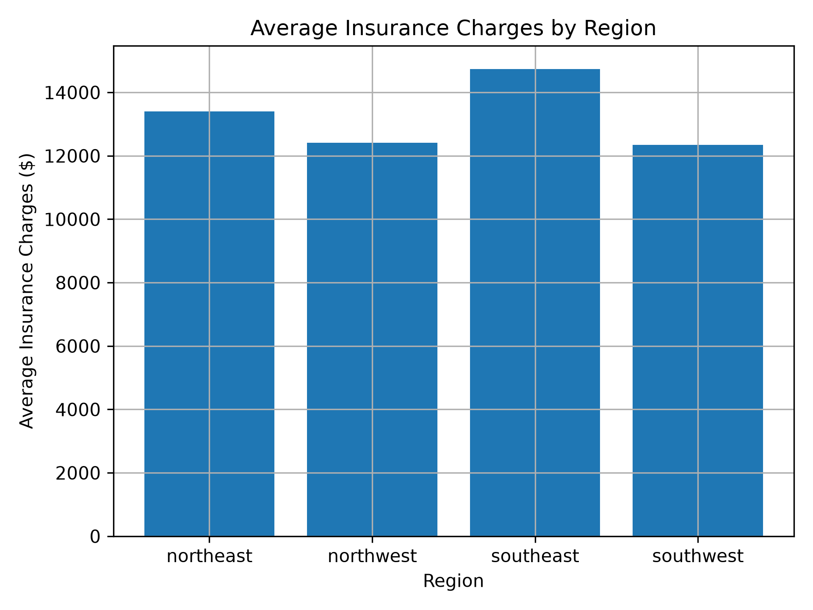
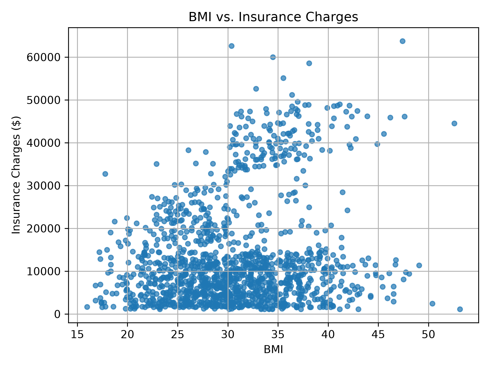
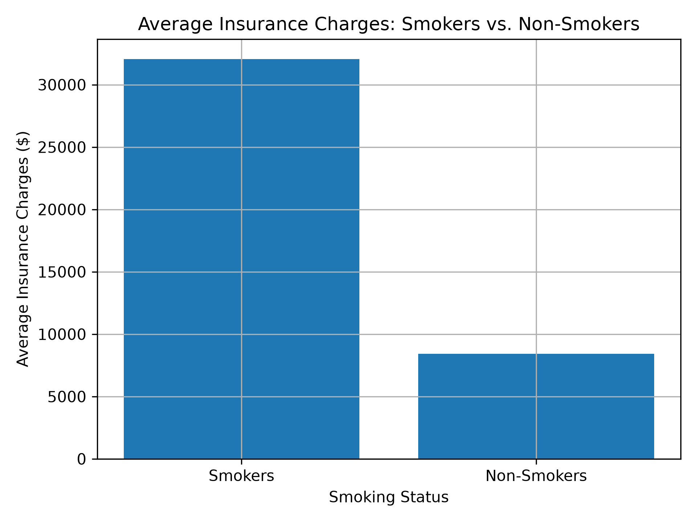
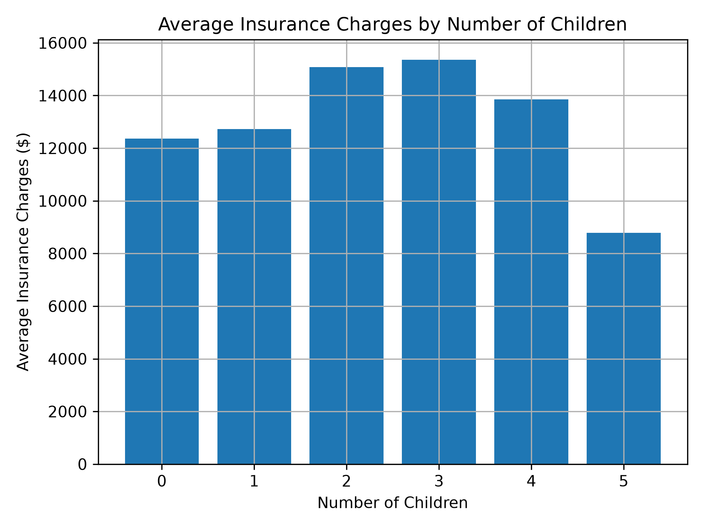

# Medical Insurance Data Analysis

## Project Overview

This project analyzes a real-world medical insurance dataset using Python,
Pandas, and Matplotlib. The goal was to investigate how factors such as age,
BMI, smoking status, region, sex, and number of children relate to insurance
charges.

## Tools & Technologies

- Python
- Pandas
- Matplotlib

## Dataset

The dataset contains information about medical insurance customers, including:

- Age
- Sex
- BMI
- Number of children
- Smoking status
- Region
- Insurance charges

## Questions Explored

- How do insurance charges differ between smokers and non-smokers?
- How are insurance charges related to age?
- How do insurance charges vary across BMI categories?
- How do average charges differ across regions?
- How do charges differ by sex?
- How do charges vary based on number of children?
- Which customers have the highest and lowest insurance charges?

## Key Findings

- Smokers had substantially higher average insurance charges than non-smokers.
- Insurance charges generally increased with age.
- The Southeast region had the highest average insurance charges.
- Insurance charges varied across BMI categories.
- The number of children showed relatively small differences in average charges.
- Many of the customers with the highest charges were older and/or smokers.

## Visualizations

### Age vs. Insurance Charges

### Insurance Charges by Region

### BMI vs. Insurance Charges

### Smokers vs. Non-Smokers

### Insurance Charges by Number of Children

## Skills Demonstrated

- Data exploration and preparation
- Data filtering
- Grouped analysis using Pandas
- Descriptive statistics
- Sorting and ranking
- Categorical analysis
- Data visualization
- Python programming
- Communicating data-driven findings

## Conclusion

Overall, the analysis found that smoking status and age showed the clearest relationships with insurance charges, while factors such as sex and number of children showed smaller differences in average charges. This project strengthened my ability to use Python and Pandas to explore real-world data and communicate findings through visualizations.
